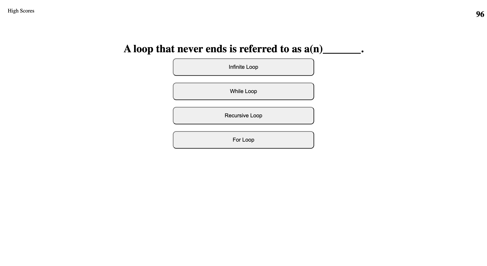

# code-quiz

## Goals
- Create a coding quiz using exclusively the JS DOM
- When the start button is clicked
    - Timer starts
    - Question is presented
- Each incorrect answer subtracts 5 seconds from the timer
- The quiz ends with the timer or lack of new questions
- Score is saved to local storage

